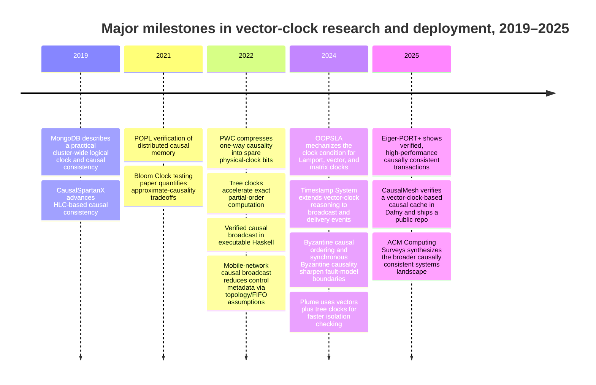
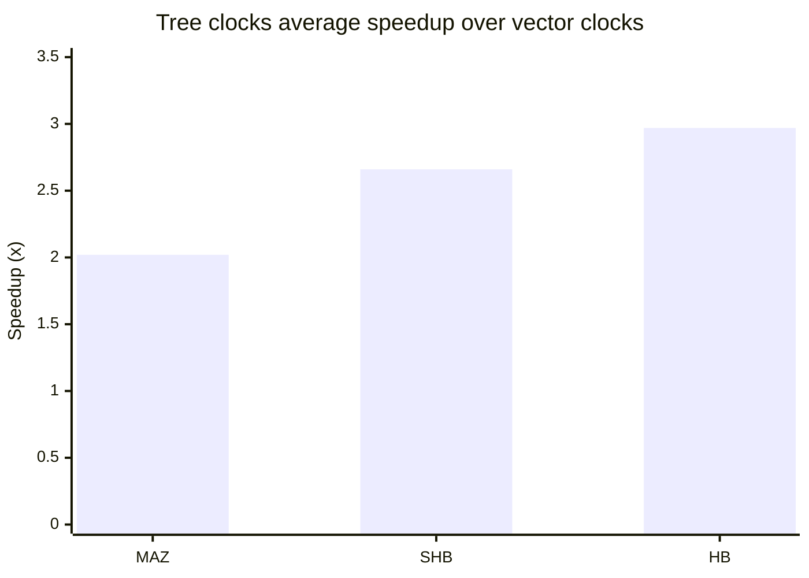

# Vector Clocks Research in 2021–2026

## Executive summary

Vector clocks still define the gold standard for **exact causality tracking**: unlike scalar logical clocks, they can distinguish causality from concurrency, and recent formal work continues to treat that exactness as the reference point. But the same old bottleneck remains load-bearing: exact causality metadata scales with the dimension of the underlying partial order, and in common deployments that still means metadata and merge/compare costs that grow with the number of tracked participants. The most important recent research therefore does **not** “replace” vector clocks so much as split into four strategies: make exact clocks faster on real traces, weaken the semantics slightly to cut metadata, move to bounded-scope variants such as version vectors and dots, or formally verify the causal layer so systems can rely on it safely. citeturn27view3turn15search0turn31view0turn32view0turn36view0

The strongest recent technical advances are these. **Tree clocks** are the clearest exact-data-structure advance: they keep vector-clock semantics for important partial orders but make join/copy proportional to updated structure instead of paying an a priori full-width scan, with reported average speedups of 2.02× to 2.97× over vector clocks on benchmark traces. **Bloom clocks** and related probabilistic formulations trade exactness for smaller metadata, yielding lower space/time/message overhead at the price of false positives. **Physical/hybrid scalar approaches** such as HLC follow the opposite route: they keep constant-size timestamps and practical deployability, but they only preserve the forward direction of causality rather than giving vector-clock-style exact concurrency detection. **Formal methods** are now a serious branch of the literature: recent work mechanizes the clock condition itself, verifies causal broadcast implementations, verifies causally consistent storage abstractions, and verifies causal caches and database protocols end to end. citeturn31view0turn10search4turn32view0turn19view0turn16search8turn38view0turn41search0turn42view2turn24view5

In practice, production systems mostly avoid full, global vector clocks whenever they can. They instead use **version vectors and dots** in replicated objects, **vector clocks in bounded subsystems** such as cluster gossip or causal caches, or **HLCs** for transaction timestamps and MVCC. Recent official documentation and repositories from Riak, Akka/Pekko, CockroachDB, YugabyteDB, and CausalMesh all reflect that pattern. citeturn23view0turn23view1turn23view7turn23view2turn23view3turn23view4turn42view4

The actionable research gaps are also clear. The literature still lacks a **common benchmark suite** for comparing clock mechanisms across the same workloads; exact, dynamic-membership clocks still lack a mainstream successor to fixed-width vectors; liveness and inverse-clock properties remain less mechanized than safety; and Byzantine or adversarial settings still expose sharp impossibility boundaries. The next high-value work will likely be **adaptive hybrid mechanisms** that switch among exact, approximate, and scalar modes; **formally verified implementations** with both safety and liveness; and **dynamic/edge/serverless causality mechanisms** that retain exactness where it matters but compress or localize metadata elsewhere. citeturn35view0turn37view1turn38view0turn42view2turn31view0turn32view0turn30view0

## Research landscape and timeline

The recent vector-clock literature is not concentrated in one venue family. It spans distributed-systems and networking venues such as ICDCIT, ICDCN, IEEE TPDS, *Information and Computation*, and *The Journal of Supercomputing*; systems venues such as ASPLOS and PVLDB; and PL/formal-methods venues such as POPL, OOPSLA, IFL, and TACAS. The result is a field that is simultaneously about metadata/data structures, consistency protocols, program analysis, and mechanized proof. The 2025 ACM Computing Surveys article on causally consistent systems is a useful sign that the area has become broad enough to need synthesis rather than only invention. citeturn43search12turn20search16turn34search0turn43search1turn22search8turn31view0turn11search3turn36view0turn38view0turn26search8turn10search3

Repeated contributors in the recent literature include entity["people","Ajay D. Kshemkalyani","distributed computing researcher"] and entity["people","Anshuman Misra","computer scientist"] on Bloom-style and Byzantine-aware causality; entity["people","Sandeep S. Kulkarni","distributed systems researcher"] and collaborators on physical/hybrid clocks and replay-oriented clocks; entity["people","Umang Mathur","program analysis researcher"], entity["people","Andreas Pavlogiannis","computer scientist"], and entity["people","Mahesh Viswanathan","computer scientist"] on tree-clock exactness and lower-bound-aware data structures; entity["people","Lindsey Kuper","computer scientist"] and collaborators on mechanized causal broadcast and clock reasoning; and entity["people","Lars Birkedal","computer scientist"]’s group on causal memory and CRDT verification. citeturn32view0turn8view6turn35view0turn19view0turn30view0turn31view0turn38view0turn36view0turn41search0turn40search6

These milestones are drawn from the original SIGMOD, arXiv, POPL, ICDCIT, ICDCN, ASPLOS, IFL, OOPSLA, TPDS, *Information and Computation*, PVLDB, TACAS, and ACM CSUR sources, plus official project repositories where available. citeturn28search1turn16search1turn41search0turn32view0turn20search2turn31view0turn38view0turn22search0turn36view0turn22search8turn34search0turn8view6turn29search0turn24view5turn23view4turn10search3

## Recent academic advances

Recent work is best read as four lines of attack. One line makes exact causality cheaper without weakening semantics, with tree clocks as the flagship result. A second line uses **approximation or bounded semantics** to shrink metadata, as in Bloom clocks, replay clocks, and physical-clock-with-causality proposals. A third line lifts causality into **systems protocols** for causal storage, broadcast, and serverless caching. A fourth line makes the whole stack **machine-checkable**, from the abstract clock condition to executable broadcast libraries and database protocols. citeturn31view0turn32view0turn30view0turn25view0turn42view4turn36view0turn38view0turn41search0turn24view5

| Citation | Year | Venue | Problem addressed | Key idea | Complexity | Pros / cons |
|---|---:|---|---|---|---|---|
| Misra & Kshemkalyani, *The Bloom Clock for Causality Testing* citeturn32view0turn43search12 | 2021 | ICDCIT | Reduce vector-clock metadata while preserving useful causality tests | Counting-Bloom-filter timestamps with no false negatives but possible false positives | Timestamp/message size `O(m)` with `m < n`; compare/merge `O(m)`; `k` hash updates per event | **Pros:** much smaller metadata, tunable tradeoff, good empirical behavior in send-heavy workloads. **Cons:** false positives, workload-sensitive confidence |
| Gondelman et al., *Distributed Causal Memory* citeturn41search0turn41search1 | 2021 | POPL | Specify and verify a causally consistent distributed database | Higher-order distributed separation logic with vector-timestamped causal memory and modular client/server proofs | Replica-indexed vector timestamps, so metadata grows with tracked replicas | **Pros:** first modular machine-checked verification of a causally consistent DB implementation. **Cons:** not a new low-overhead clock mechanism |
| Kulkarni, Appleton & Nguyen, *Achieving Causality with Physical Clocks* citeturn19view0turn20search2turn20search9 | 2022 | ICDCN | Encode useful causality in constant-size physical timestamps | PWC uses “extraneous” low bits of physical clocks to record one-way causality | Scalar timestamp, compare in `O(1)` | **Pros:** standard integer comparison, compact, robust to skew/transient errors, needs only 6–9 spare bits in a typical setting. **Cons:** only one-way causality, not vector-clock exactness |
| Mathur et al., *A Tree Clock Data Structure for Causal Orderings in Concurrent Executions* citeturn31view0turn10search4 | 2022 | ASPLOS | Remove the `Θ(k)` join/copy bottleneck of vector clocks | Hierarchical tree representation; update cost proportional to changed entries | Join/copy roughly proportional to modified entries instead of flat `Θ(k)` scans; optimal for HB on a given trace | **Pros:** exact, asymptotically optimal for HB, strong empirical speedups. **Cons:** strongest evidence is in trace analysis rather than geo-replicated storage |
| Redmond et al., *Verified Causal Broadcast with Liquid Haskell* citeturn38view0 | 2022 | IFL | Mechanically verify an executable causal broadcast library | Use refinement types to prove causal delivery of a standard vector-clock broadcast protocol | Standard vector-clock metadata `O(n)`; deliverability checks linear in vector width plus queue management | **Pros:** executable proof artifact; demonstrated as KV-store foundation. **Cons:** safety proof only, not liveness; still full-vector metadata |
| Jiang et al., *Tunable Causal Consistency* citeturn25view0 | 2022 | arXiv preprint / prototype | Per-operation selection among session guarantees across multiple keys | Extend `(vis, ar)` specification; implement TCCSTORE using multiple dependency-tracking vector clocks | Client/server metadata grows linearly with tracked datacenters / partitions / guarantee state | **Pros:** formal model plus working system; better than full causal consistency on their prototype. **Cons:** specialized notion of tunable guarantees, not a general new clock |
| Castello, Redmond & Kuper, *Inductive Diagrams for Causal Reasoning* citeturn36view0turn37view1turn37view3 | 2024 | OOPSLA | Mechanize the clock condition across multiple logical clocks | Causal separation diagrams and a generic Agda proof for Lamport, vector, and matrix clocks | Proof framework; runtime cost unchanged for the instantiated clocks | **Pros:** generic, reusable proof of the forward clock condition; first mechanized proofs for both matrix-clock variants. **Cons:** does not itself reduce runtime cost; inverse condition remains protocol-dependent |
| Muñoz-Fernández, Arévalo-Viñuales & de-las-Heras-Quirós, *Timestamp System for Causal Broadcast Communication* citeturn22search2turn22search8 | 2024 | *The Journal of Supercomputing* | Timestamp both broadcast and delivery events, not only broadcasts | CTS uses vector-clock-based timestamps that capture causal relations among both event classes with maximal accuracy | Vector-clock-sized metadata, therefore linear in tracked processes | **Pros:** cleaner reasoning about CRB implementations and global-state monitoring. **Cons:** preserves vector-clock width costs |
| Misra & Kshemkalyani, *Detecting causality in the presence of Byzantine processes* citeturn8view6turn43search1 | 2024 | *Information and Computation* | Identify when causality detection is still solvable under Byzantine faults | Show impossibility asynchronously; give synchronous solutions via RSM+vector clocks and via matrix clocks | RSM approach uses `(3t+1)n` processes and `O(nt^2)` messages; matrix-clock algorithm uses `O(n^2)` messages and `f+2` rounds | **Pros:** foundational possibility result for synchronous Byzantine settings. **Cons:** heavy overhead; asynchronous case remains impossible |
| Zhang et al., *CausalMesh* citeturn8view11turn42view2turn42view4turn11search3 | 2025 | VLDB paper / public repo | Causally consistent caching with roaming/serverless clients | Vector clocks plus explicit cross-key dependencies; formal verification in Dafny | Vector clocks `O(n)` plus dependency map over referenced keys | **Pros:** coordination-free and abort-free read/write ops for roaming clients; verified; strong empirical gains. **Cons:** transactional variant gives up abort-freedom; still vector-based metadata |

Two patterns stand out from that table. First, the exactness frontier moved mainly in **data structures** and **proofs**, not in new broad-spectrum exact clocks that beat vector clocks in the worst case. Second, the scaling frontier moved mainly by **changing the contract**: approximate causality, one-way causality, bounded-scope object causality, or topology-assisted causal delivery. That is a substantive change in emphasis from the older literature, which mostly searched for a universally better exact timestamp. citeturn31view0turn32view0turn19view0turn22search0turn35view0

The empirical literature is also fragmented. Recent papers do report strong measurements, but they use **different workloads, different baselines, and different goals**: dynamic-trace speedup, approximate-classification quality, prototype KV throughput, or tail-latency reduction in serverless caches. A single cross-paper throughput plot would therefore be misleading. The chart below uses the cleanest within-paper comparison, and the following table summarizes the strongest reported numbers from the rest. citeturn10search4turn32view0turn25view0turn24view3turn42view1

The Tree Clocks paper reports average speedups of 2.02× for MAZ, 2.66× for SHB, and 2.97× for HB by replacing vector clocks with tree clocks. citeturn10search4turn31view0

| Paper | Workload / metric | Reported result |
|---|---|---|
| *The Bloom Clock for Causality Testing* citeturn32view0 | Client-server experiment with `n=50`, `m=5`, `k=2` | Precision `0.985`, accuracy `0.992`, false-positive rate `0.015`; performance improves as send-heavy causal spread increases |
| *Tunable Causal Consistency* citeturn25view0 | Prototype TCCSTORE on Aliyun | Latency below `38 ms` for all workloads; throughput up to about `2800 ops/s`; negligible overhead compared with eventual consistency |
| *Pushing the Limit: Verified Performance-Optimal Causally-Consistent Database Transactions* citeturn24view3turn24view4turn24view5 | Eiger-PORT+ cluster evaluation | Up to `1.8×` throughput over Eiger-PORT and `2.5×` over Eiger, with similar latency and a stronger guarantee |
| *CausalMesh* citeturn42view0turn42view1 | Serverless microbenchmarks and hotspot workloads | Throughput `1.57×–2.2×` higher; median latency `7%–59%` lower; tail latency reductions up to `97%`; transactional variant still `1.3×–1.8×` higher throughput than FaaSTCC |

## Variants, optimizations, and alternatives

Classic variants such as **dotted version vectors** and **interval tree clocks** still matter, but mostly as **living design patterns** inside systems rather than as the center of the newest peer-reviewed work. The lineage here runs through entity["people","Nuno Preguiça","computer scientist"], entity["people","Carlos Baquero","computer scientist"], and entity["people","Paulo Sergio Almeida","computer scientist"]: dotted version vectors refine version-vector contexts so a system can talk precisely about the update that created each concurrent value, while interval tree clocks remove the need for a fixed, globally known participant set and support decentralized process creation and churn. Recent documentation from Riak, Pekko, and the interval-tree-clock reference implementation shows that those ideas remain very much alive in practice. citeturn13search16turn15search17turn23view0turn23view6turn23view7

Compared with entity["people","Leslie Lamport","computer scientist"]’s scalar clocks, vector clocks remain the reference mechanism for **sound and complete** causal comparison under the tracked process model. Modern work frames that distinction cleanly: scalar or HLC-like timestamps give **completeness** in the forward direction, while vector clocks additionally give **soundness**, so comparisons can distinguish precedence from concurrency rather than merely assign a monotone scalar order. citeturn14search1turn27view3turn16search8

| Citation | Year | Venue / source | Problem addressed | Key idea | Complexity | Pros / cons |
|---|---:|---|---|---|---|---|
| Lamport, *Time, Clocks, and the Ordering of Events in a Distributed System* citeturn14search1 | 1978 | CACM | Generate a causality-consistent total order with scalar metadata | Scalar logical clock | Timestamp/update/compare `O(1)` | **Pros:** tiny metadata, simple. **Cons:** cannot distinguish concurrency from causality |
| Vector clocks as summarized in modern timestamp-soundness work citeturn27view3 | classic / summarized 2024 | PVLDB survey context | Exact causality tracking | One counter per actor / process, merged componentwise | Timestamp/message/update/compare `O(n)` in tracked participants | **Pros:** sound and complete under the model. **Cons:** linear-width metadata and fixed participant assumptions |
| Version vectors in distributed CRDT/state metadata citeturn23view7 | ongoing | Official Pekko docs | Per-object version / causality tracking | Replica-indexed counts on object versions | `O(r)` in replicas for the object | **Pros:** narrower scope than global vectors, fits replicated objects well. **Cons:** still linear; by itself can overapproximate concurrent object histories |
| Preguiça et al., *Dotted Version Vectors*; Riak DVV docs citeturn13search16turn23view0 | 2010 / deployed docs | ArXiv / official docs | Avoid false conflicts in optimistic replication | Add a “dot” naming the precise event that created a value | Roughly `O(r)` plus dot metadata | **Pros:** precise sibling/conflict reasoning; mature deployment in Riak. **Cons:** merge/context handling is more intricate than plain vectors |
| Almeida et al., *Interval Tree Clocks*; reference implementation repo citeturn15search17turn23view6 | 2008 / repo | paper / official repo | Dynamic membership and decentralized process creation | Variable-size stamp with `fork`, `event`, `join` | Variable-size; adapts to active entities rather than fixed `n` | **Pros:** handles churn without global identifiers. **Cons:** more complex representation; limited mainstream production use |
| Matrix clocks as formalized and revisited in recent proof work citeturn37view3turn8view6 | classic / revisited 2024 | OOPSLA / *Information and Computation* | Knowledge-of-knowledge, stability, synchronous Byzantine detection | Two-dimensional timestamps | `O(n^2)` metadata / compare | **Pros:** useful for global-state reasoning and some Byzantine/synchrony algorithms. **Cons:** cost grows quadratically |
| HLC and PWC citeturn16search8turn19view0turn23view2turn23view3 | 2014 / 2022 / current docs | original paper, ICDCN, official docs | Compact practical transaction/order timestamps | Physical time plus logical tie-breaker, or spare-bit causality in physical clocks | `O(1)` scalar metadata | **Pros:** practical, production-proven, wall-time aligned. **Cons:** preserves forward causality only; not exact concurrency tracking |
| Bloom clocks citeturn32view0 | 2021 | ICDCIT | Probabilistic causality tracking with bounded metadata | Counting-Bloom-filter timestamp | `O(m)` with configurable `m`, `k` | **Pros:** space/message savings, no false negatives. **Cons:** false positives; parameter tuning and workload dependence |
| Tree clocks citeturn31view0 | 2022 | ASPLOS | Faster exact partial-order computation | Hierarchical exact representation rather than flat vectors | Join/copy proportional to changed entries | **Pros:** exact semantics with better real costs on traces. **Cons:** strongest evidence is for analysis engines, not general distributed storage |
| CRDTs and causal broadcast as alternatives at the abstraction level citeturn40search6turn23view7turn22search0turn22search8 | 2022–2024 docs/papers | OOPSLA / official docs / ICDCN / JSC | Avoid pushing full general causality into every object/message | Use datatype convergence rules or a communication abstraction with causal delivery | Type- or protocol-specific | **Pros:** often the right systems abstraction. **Cons:** they do not eliminate causality metadata; op-based CRDTs still require causal delivery, and causal broadcast may still use vectors or topology assumptions |

The cleanest comparison is this. **Lamport clocks** and **HLCs** are compact scalar clocks that preserve monotonicity and forward causality but not exact concurrency. **Vector clocks** and their descendants are exact but wider. **Version vectors, dots, and ITCs** are scope-control mechanisms: they try to keep exactness while shrinking the domain that must be tracked. **Bloom clocks** and similar schemes weaken truth. **Tree clocks** keep truth but exploit sparsity/structure. **CRDTs and causal broadcast** move the problem one layer up, often reducing how often exact general-purpose vector comparisons are needed. citeturn27view3turn23view2turn23view3turn23view0turn23view6turn32view0turn31view0turn40search6turn22search0

## Formal models and proofs

The most striking shift in the last five years is how much of the literature now treats causality as a **proof object**, not just a metadata format. The 2024 OOPSLA paper on inductive diagrams is especially important because it does not merely verify one protocol; it gives a generic Agda proof of the **clock condition** for a class of logical clocks and instantiates that proof for Lamport, vector, and two matrix-clock variants. That moves part of the vector-clock story from folklore and textbook proof sketches into reusable mechanized mathematics. citeturn37view1turn37view3

Below that ADT layer, several works verify **protocols that rely on causality**. The Liquid Haskell causal-broadcast work proves that an executable implementation never delivers messages in a causality-violating order and then uses the library as the basis of a distributed key-value store. The POPL 2021 distributed-causal-memory work verifies a causally consistent database in Aneris/Coq. The OOPSLA 2022 CRDT work verifies op-based CRDTs under a causal-delivery substrate. The 2025 CausalMesh work verifies a vector-clock-and-dependency serverless cache in Dafny, with proofs parameterized over arbitrary configurations rather than fixed small-node model-checking bounds. citeturn38view0turn41search0turn40search6turn42view2

The strongest database-side verification result in the recent literature is probably Eiger-PORT+, which proves a stronger causally consistent transactional guarantee in Isabelle/HOL and reports better throughput than earlier Eiger-family protocols. TCC takes a related route from the specification side, extending the `(vis, ar)` framework with per-operation consistency levels and then implementing a multiple-key protocol using vector clocks. Together, those papers suggest that the frontier is moving from proving “causal delivery is safe” toward proving that **causal subsystems implement the exact consistency level claimed by the database**. citeturn24view5turn24view3turn25view0

The remaining gap is that the easiest results to mechanize are still **forward safety properties**. Redmond et al. give safety but not liveness. Castello et al. explicitly separate the forward clock condition from the inverse clock condition, noting that the inverse direction depends on protocol discipline rather than the abstract clock ADT alone. In other words, “timestamps respect causality” is now increasingly proven, but “timestamps characterize all and only the causal structure of the deployed protocol under realistic transport, churn, and fault assumptions” is still harder and less common. citeturn38view0turn37view1

## Practical implementations and empirical evidence

What production and near-production systems actually deploy is telling. They overwhelmingly prefer one of three patterns: **bounded-scope vector-like metadata**, **HLC-style scalar timestamps**, or **datatype/protocol abstractions** that hide the details from the application. Riak KV uses dotted version vectors for object conflict resolution. Akka uses vector clocks in cluster gossip. Pekko’s ORSet uses version vectors plus a birth-dot per element and explicitly requires causal delivery for delta-CRDTs. CockroachDB and YugabyteDB use HLCs for transaction timestamps and MVCC rather than full vector timestamps. CausalMesh exposes a third pattern: keep vector clocks, but localize them inside a specific causal cache substrate and verify the whole mechanism. citeturn23view0turn23view1turn23view7turn23view2turn23view3turn23view4turn42view4

| System / implementation | Clock or metadata form | What it is used for | Source |
|---|---|---|---|
| Riak KV | Dotted version vectors | Identify the update that created each value and reconcile concurrent siblings | Riak DVV docs citeturn23view0 |
| Akka cluster | Vector clocks | Reconcile and merge cluster-state differences during gossip | Akka cluster docs citeturn23view1 |
| Apache Pekko ORSet / ORMap | Version vector plus birth dots | Track causality of element-level adds/removes; delta-CRDTs require causal delivery | Pekko docs citeturn23view7 |
| CockroachDB | Hybrid logical clocks | Transaction timestamps, MVCC versioning, and efficient read ordering | CockroachDB docs citeturn23view2 |
| YugabyteDB | Hybrid logical clocks | Strictly monotonic hybrid timestamps exchanged on RPCs, including across leader changes | YugabyteDB docs citeturn23view3 |
| Interval Tree Clocks reference repo | Interval tree clocks | Dynamic-membership logical-clock library in Java, C, and Erlang | Official repo citeturn23view6 |
| CausalMesh repo | Vector clocks plus dependency map | Prototype serverless causal cache; repo also includes Dafny verification artifacts | Official repo / paper citeturn23view4turn42view2 |

The implementation pattern behind that table is analytically important. Systems keep **full vectors** when the participant set is modest and semantics require exactness, keep **object-local versions/dots** when conflict detection is the target, and keep **HLCs** when transaction ordering and wall-time alignment matter more than exact concurrency detection. That is also why modern “vector-clock research” cannot be read narrowly as work on one timestamp array: the real design space is now about where exact causality belongs, where it can be scoped, and where it is better replaced by scalar or protocol-level structure. citeturn23view0turn23view1turn23view7turn23view2turn23view3turn42view4

## Scalability limits, open problems, and future directions

The deepest limitation is still the old one: **if you want exact causality, somebody pays for the partial order’s dimension**. Recent papers continue to cite the Charron-Bost lower-bound perspective because it remains the conceptual reason vector clocks are hard to beat in the worst case. Modern advances therefore escape by specializing: tree clocks exploit trace structure; version vectors and dots exploit object scope; ITCs exploit dynamic naming structure; HLC/PWC weaken the semantics to forward causality; Bloom clocks probabilize; and causal broadcast protocols sometimes trade vector metadata for FIFO/topology assumptions. citeturn15search0turn32view0turn31view0turn23view6turn19view0turn22search0

Dynamic environments and adversarial environments remain the hardest regimes. ITCs address churn, but a modern exact, mainstream, production-grade successor to fixed-width vectors still has not emerged. Cross-key and roaming-client settings force explicit dependency maps back into the design, as seen in TCCSTORE and CausalMesh. Byzantine settings are harsher still: the 2024 and 2025 fault-model papers show that exact causal detection or ordering becomes impossible in broad asynchronous Byzantine settings, and positive results come only under stronger synchrony or weaker guarantees such as weak safety. citeturn23view6turn25view0turn42view4turn35view0turn34search0turn8view6

**Actionable research gaps**

- **Standardized benchmarks for causality mechanisms.** The field needs a shared benchmark suite that can compare vectors, dots, ITCs, Bloom clocks, HLC/PWC-style mechanisms, and protocol-level causal broadcast under the same workloads, churn models, locality patterns, and fault assumptions. Today’s results are individually useful but not directly comparable. citeturn31view0turn32view0turn25view0turn24view4turn42view1
- **Adaptive hybrid clocks.** Recent work suggests the right future system may not use one clock everywhere. A promising direction is switching dynamically among exact vector-like metadata, scalar HLC/PWC-like metadata, and approximate mechanisms based on contention, topology, or debugging mode. citeturn19view0turn32view0turn30view0
- **Verified liveness and inverse properties.** Safety proofs are advancing quickly, but end-to-end verified systems still under-cover liveness, fairness, and inverse clock-condition claims. High-value future work would combine ADT-level proofs, protocol proofs, transport assumptions, and performance arguments in one artifact. citeturn38view0turn37view1turn42view2turn24view5
- **Security-aware causality metadata.** The Byzantine papers make clear that causality under adversarial behavior is not a solved engineering problem. Practical authenticated or attestable causal metadata with low overhead remains open, especially for unicast and multicast settings. citeturn35view0turn34search0turn28search1
- **Dynamic-participant exactness.** Interval-like or sparse/hierarchical clocks need a modern revival tied to partial replication, edge/serverless placement changes, and object-local causality. CausalMesh and TCC show why this matters: causal scope is increasingly dynamic rather than fixed. citeturn23view6turn25view0turn42view4

The concise conclusion is straightforward. Vector clocks remain the **semantic reference model** for exact causality, but the latest research no longer expects one universal replacement. Instead, the field has converged on a more realistic architecture: use exact vectors or vector-derived structures where correctness depends on them; use scoped variants like version vectors and dots when object causality is enough; use HLC-like scalars when timestamp compactness and deployability dominate; and verify the causal layer formally whenever it becomes a correctness boundary. The best research opportunities now lie in **adaptive hybridization, rigorous shared benchmarking, and verified implementations that survive churn, partial replication, and adversarial faults**. citeturn27view3turn31view0turn23view0turn23view7turn23view2turn23view3turn42view2turn35view0